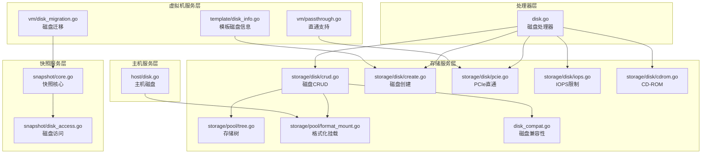
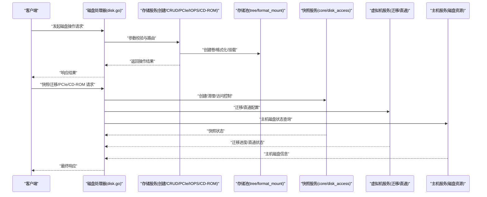
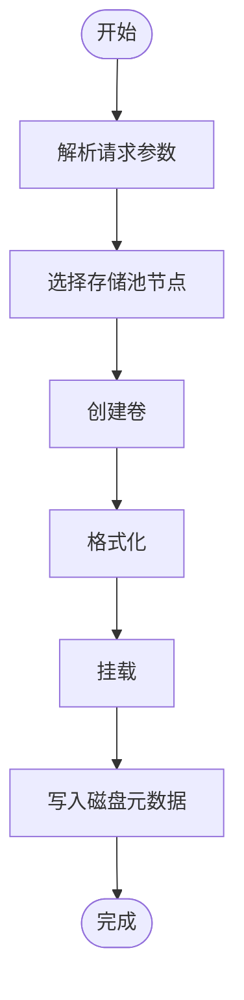
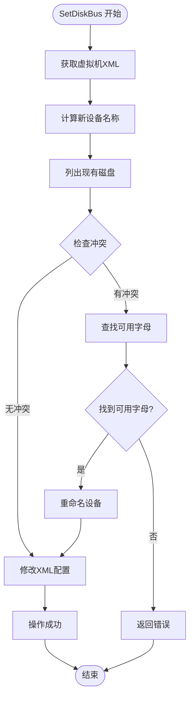
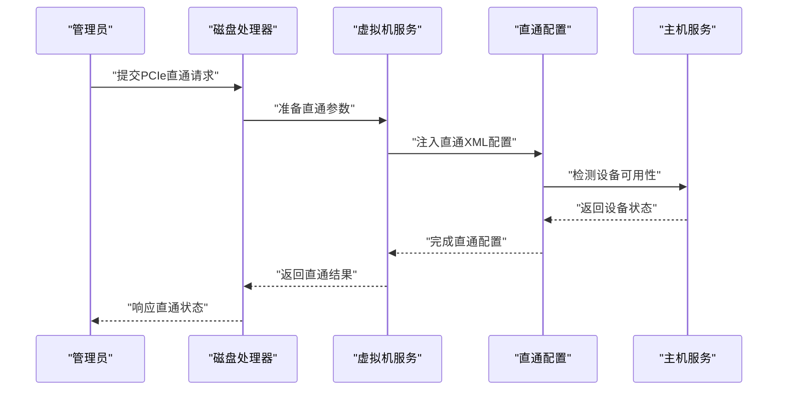
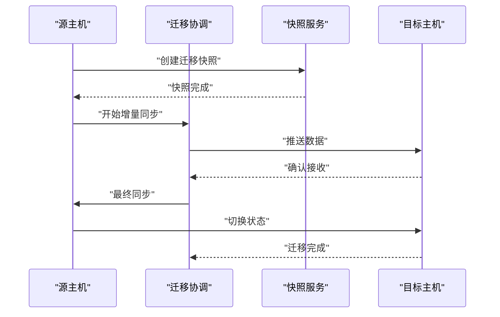
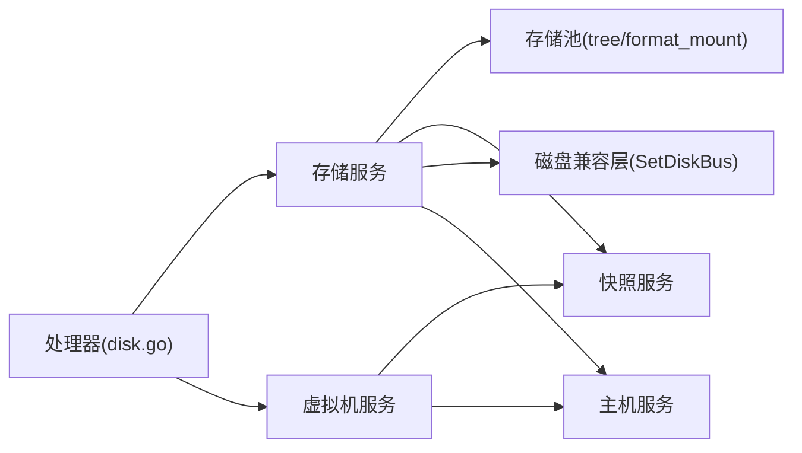

# 磁盘管理

<cite>
**本文档引用的文件**
- [server/handler/disk.go](file://server/handler/disk.go)
- [server/service/storage/disk/create.go](file://server/service/storage/disk/create.go)
- [server/service/storage/disk/crud.go](file://server/service/storage/disk/crud.go)
- [server/service/storage/disk/pcie.go](file://server/service/storage/disk/pcie.go)
- [server/service/storage/disk/iops.go](file://server/service/storage/disk/iops.go)
- [server/service/storage/disk/cdrom.go](file://server/service/storage/disk/cdrom.go)
- [server/service/snapshot/core.go](file://server/service/snapshot/core.go)
- [server/service/snapshot/disk_access.go](file://server/service/snapshot/disk_access.go)
- [server/service/vm/disk_migration.go](file://server/service/vm/disk_migration.go)
- [server/service/storage/pool/tree.go](file://server/service/storage/pool/tree.go)
- [server/service/storage/pool/format_mount.go](file://server/service/storage/pool/format_mount.go)
- [server/service/host/disk.go](file://server/service/host/disk.go)
- [server/service/vm/passthrough.go](file://server/service/vm/passthrough.go)
- [server/service/template/disk_info.go](file://server/service/template/disk_info.go)
- [server/model/storage_pool.go](file://server/model/storage_pool.go)
- [server/handler/types.go](file://server/handler/types.go)
- [server/service/disk_compat.go](file://server/service/disk_compat.go)
</cite>

## 更新摘要
**所做更改**
- 新增了智能设备命名冲突检测和解决机制章节
- 更新了磁盘 CRUD 组件分析，增加了 SetDiskBus 函数的冲突检测逻辑
- 新增了设备命名冲突检测流程图
- 补充了错误处理机制说明

## 目录
1. [简介](#简介)
2. [项目结构](#项目结构)
3. [核心组件](#核心组件)
4. [架构总览](#架构总览)
5. [详细组件分析](#详细组件分析)
6. [依赖关系分析](#依赖关系分析)
7. [性能考虑](#性能考虑)
8. [故障排查指南](#故障排查指南)
9. [结论](#结论)
10. [附录](#附录)

## 简介
本文件系统性梳理虚拟机磁盘管理能力，覆盖磁盘创建、删除、修改与查询；磁盘文件生命周期管理；磁盘性能参数配置与 IOPS 限制；PCIe 直通磁盘配置与管理；CD-ROM 光驱虚拟化；磁盘迁移、快照与备份策略；以及性能调优、容量规划与故障诊断实践。内容基于后端服务模块与处理器接口的源码进行归纳总结。

**更新** 增强了 SetDiskBus 函数的智能设备命名冲突检测和解决机制，包括冲突检测逻辑、自动字母查找算法和错误处理机制。

## 项目结构
磁盘管理相关代码主要分布在以下模块：
- 处理器层：负责对外 API 的请求处理与参数校验
- 存储服务层：负责存储池、卷创建、格式化挂载、磁盘 CRUD 操作
- 快照服务层：负责磁盘快照的创建、访问控制与清理
- 虚拟机服务层：负责磁盘迁移、PCIe 直通、模板磁盘信息等
- 主机服务层：负责主机侧磁盘资源与状态管理

**图表来源**
- [server/handler/disk.go](file://server/handler/disk.go)
- [server/service/storage/disk/crud.go](file://server/service/storage/disk/crud.go)
- [server/service/storage/disk/create.go](file://server/service/storage/disk/create.go)
- [server/service/storage/disk/pcie.go](file://server/service/storage/disk/pcie.go)
- [server/service/storage/disk/iops.go](file://server/service/storage/disk/iops.go)
- [server/service/storage/disk/cdrom.go](file://server/service/storage/disk/cdrom.go)
- [server/service/storage/pool/tree.go](file://server/service/storage/pool/tree.go)
- [server/service/storage/pool/format_mount.go](file://server/service/storage/pool/format_mount.go)
- [server/service/disk_compat.go](file://server/service/disk_compat.go)
- [server/service/snapshot/core.go](file://server/service/snapshot/core.go)
- [server/service/snapshot/disk_access.go](file://server/service/snapshot/disk_access.go)
- [server/service/vm/disk_migration.go](file://server/service/vm/disk_migration.go)
- [server/service/vm/passthrough.go](file://server/service/vm/passthrough.go)
- [server/service/template/disk_info.go](file://server/service/template/disk_info.go)
- [server/service/host/disk.go](file://server/service/host/disk.go)

**章节来源**
- [server/handler/disk.go](file://server/handler/disk.go)
- [server/service/storage/disk/crud.go](file://server/service/storage/disk/crud.go)
- [server/service/storage/disk/create.go](file://server/service/storage/disk/create.go)
- [server/service/storage/disk/pcie.go](file://server/service/storage/disk/pcie.go)
- [server/service/storage/disk/iops.go](file://server/service/storage/disk/iops.go)
- [server/service/storage/disk/cdrom.go](file://server/service/storage/disk/cdrom.go)
- [server/service/storage/pool/tree.go](file://server/service/storage/pool/tree.go)
- [server/service/storage/pool/format_mount.go](file://server/service/storage/pool/format_mount.go)
- [server/service/disk_compat.go](file://server/service/disk_compat.go)
- [server/service/snapshot/core.go](file://server/service/snapshot/core.go)
- [server/service/snapshot/disk_access.go](file://server/service/snapshot/disk_access.go)
- [server/service/vm/disk_migration.go](file://server/service/vm/disk_migration.go)
- [server/service/vm/passthrough.go](file://server/service/vm/passthrough.go)
- [server/service/template/disk_info.go](file://server/service/template/disk_info.go)
- [server/service/host/disk.go](file://server/service/host/disk.go)

## 核心组件
- 磁盘处理器（处理器层）：接收外部请求，进行参数解析与权限校验，调用存储与虚拟机服务执行具体操作。
- 存储池与卷管理（存储服务层）：提供存储树构建、卷创建、格式化与挂载、CD-ROM 挂载点管理、PCIe 设备直通、IOPS 限制配置等能力。
- 快照服务（快照服务层）：提供快照生命周期管理、磁盘访问控制与清理策略。
- 虚拟机磁盘迁移（虚拟机服务层）：在迁移前后对磁盘进行一致性检查、数据同步与状态切换。
- 主机磁盘资源（主机服务层）：负责主机侧磁盘设备发现、状态采集与资源统计。
- **智能设备命名冲突检测**（存储兼容层）：提供 SetDiskBus 函数的智能设备命名冲突检测和解决机制，确保磁盘设备名称唯一性和系统稳定性。

**章节来源**
- [server/handler/disk.go](file://server/handler/disk.go)
- [server/service/storage/disk/crud.go](file://server/service/storage/disk/crud.go)
- [server/service/storage/disk/create.go](file://server/service/storage/disk/create.go)
- [server/service/storage/disk/pcie.go](file://server/service/storage/disk/pcie.go)
- [server/service/storage/disk/iops.go](file://server/service/storage/disk/iops.go)
- [server/service/storage/disk/cdrom.go](file://server/service/storage/disk/cdrom.go)
- [server/service/snapshot/core.go](file://server/service/snapshot/core.go)
- [server/service/snapshot/disk_access.go](file://server/service/snapshot/disk_access.go)
- [server/service/vm/disk_migration.go](file://server/service/vm/disk_migration.go)
- [server/service/host/disk.go](file://server/service/host/disk.go)
- [server/service/disk_compat.go](file://server/service/disk_compat.go)

## 架构总览
下图展示磁盘管理从请求到执行的关键路径与模块交互：

**图表来源**
- [server/handler/disk.go](file://server/handler/disk.go)
- [server/service/storage/disk/create.go](file://server/service/storage/disk/create.go)
- [server/service/storage/disk/crud.go](file://server/service/storage/disk/crud.go)
- [server/service/storage/disk/pcie.go](file://server/service/storage/disk/pcie.go)
- [server/service/storage/disk/iops.go](file://server/service/storage/disk/iops.go)
- [server/service/storage/disk/cdrom.go](file://server/service/storage/disk/cdrom.go)
- [server/service/storage/pool/tree.go](file://server/service/storage/pool/tree.go)
- [server/service/storage/pool/format_mount.go](file://server/service/storage/pool/format_mount.go)
- [server/service/snapshot/core.go](file://server/service/snapshot/core.go)
- [server/service/snapshot/disk_access.go](file://server/service/snapshot/disk_access.go)
- [server/service/vm/disk_migration.go](file://server/service/vm/disk_migration.go)
- [server/service/vm/passthrough.go](file://server/service/vm/passthrough.go)
- [server/service/host/disk.go](file://server/service/host/disk.go)

## 详细组件分析

### 磁盘创建与生命周期管理
- 创建流程：由处理器接收请求，调用存储服务创建卷，选择合适的存储池节点，执行格式化与挂载，生成磁盘元数据并返回。
- 生命周期：包含创建、挂载、卸载、删除等阶段；删除前需确保未被虚拟机使用，并清理相关挂载点与快照。
- 存储池选择：通过存储树结构定位可用节点，结合容量与性能指标进行决策。

**图表来源**
- [server/service/storage/disk/create.go](file://server/service/storage/disk/create.go)
- [server/service/storage/pool/tree.go](file://server/service/storage/pool/tree.go)
- [server/service/storage/pool/format_mount.go](file://server/service/storage/pool/format_mount.go)

**章节来源**
- [server/handler/disk.go](file://server/handler/disk.go)
- [server/service/storage/disk/create.go](file://server/service/storage/disk/create.go)
- [server/service/storage/pool/tree.go](file://server/service/storage/pool/tree.go)
- [server/service/storage/pool/format_mount.go](file://server/service/storage/pool/format_mount.go)

### 磁盘 CRUD 与查询
- CRUD 实现：提供磁盘的创建、读取、更新、删除接口；更新时支持容量扩容、介质类型变更等；查询支持按条件过滤与分页。
- 权限与校验：处理器层统一进行鉴权与参数校验，避免越权与非法输入进入存储层。
- 数据一致性：删除前检查快照链与挂载状态，防止误删造成数据丢失。
- **智能设备命名冲突检测**：SetDiskBus 函数实现了智能的设备命名冲突检测和解决机制，确保磁盘设备名称的唯一性和系统稳定性。

**更新** 增强了 SetDiskBus 函数的智能设备命名冲突检测和解决机制，包括冲突检测逻辑、自动字母查找算法和错误处理机制。

**图表来源**
- [server/service/storage/disk/crud.go](file://server/service/storage/disk/crud.go)

**章节来源**
- [server/handler/disk.go](file://server/handler/disk.go)
- [server/service/storage/disk/crud.go](file://server/service/storage/disk/crud.go)
- [server/service/disk_compat.go](file://server/service/disk_compat.go)

### PCIe 直通磁盘配置与管理
- 配置流程：在虚拟机启动前，将宿主磁盘设备通过直通机制映射到客户机，同时在处理器与虚拟机服务中完成参数注入与状态跟踪。
- 安全与隔离：直通设备需满足硬件兼容性与安全策略要求，避免与宿主系统产生冲突。
- 运行时监控：通过主机服务层采集设备状态，配合虚拟机运行时配置进行动态调整。

**图表来源**
- [server/service/storage/disk/pcie.go](file://server/service/storage/disk/pcie.go)
- [server/service/vm/passthrough.go](file://server/service/vm/passthrough.go)
- [server/service/host/disk.go](file://server/service/host/disk.go)

**章节来源**
- [server/service/storage/disk/pcie.go](file://server/service/storage/disk/pcie.go)
- [server/service/vm/passthrough.go](file://server/service/vm/passthrough.go)
- [server/service/host/disk.go](file://server/service/host/disk.go)

### CD-ROM 光驱虚拟化
- 实现方式：通过存储服务为 ISO 镜像创建挂载点，将其作为 CD-ROM 设备挂载至虚拟机，支持热插拔与多介质切换。
- 使用场景：用于系统安装、驱动注入或临时数据传输，不参与持久化存储。
- 安全建议：仅允许受信 ISO 源，避免加载不受信任介质。

**章节来源**
- [server/service/storage/disk/cdrom.go](file://server/service/storage/disk/cdrom.go)

### 磁盘性能参数与 IOPS 限制
- 参数配置：支持为磁盘设置吞吐量上限、IOPS 上限等性能参数，以保障宿主系统与其他虚拟机的公平性。
- 生效机制：通过块设备后端参数下发与调度策略实现，运行时可动态调整但需评估业务影响。
- 建议策略：根据工作负载类型（数据库、文件服务、桌面等）设定差异化限额，定期复核与优化。

**章节来源**
- [server/service/storage/disk/iops.go](file://server/service/storage/disk/iops.go)

### 磁盘迁移技术实现
- 迁移流程：在迁移前进行一致性检查，迁移过程中保持数据连续性，迁移完成后切换状态并清理源端残留。
- 技术要点：采用增量同步与快照配合，减少停机时间；对共享存储与独立存储采取不同策略。
- 可靠性保障：失败回滚与重试机制，迁移日志追踪与告警通知。

**图表来源**
- [server/service/vm/disk_migration.go](file://server/service/vm/disk_migration.go)
- [server/service/snapshot/core.go](file://server/service/snapshot/core.go)
- [server/service/snapshot/disk_access.go](file://server/service/snapshot/disk_access.go)

**章节来源**
- [server/service/vm/disk_migration.go](file://server/service/vm/disk_migration.go)
- [server/service/snapshot/core.go](file://server/service/snapshot/core.go)
- [server/service/snapshot/disk_access.go](file://server/service/snapshot/disk_access.go)

### 磁盘快照与备份策略
- 快照能力：支持创建、删除、清理与访问控制；快照链维护保证数据可恢复性。
- 访问控制：限制对快照的并发写入与删除，避免破坏快照一致性。
- 备份策略：结合快照与导出机制制定周期性备份计划，确保 RPO/RTO 满足业务需求。

**章节来源**
- [server/service/snapshot/core.go](file://server/service/snapshot/core.go)
- [server/service/snapshot/disk_access.go](file://server/service/snapshot/disk_access.go)

### 模板磁盘信息与导入
- 模板磁盘信息：用于识别模板镜像中的磁盘布局、容量与介质类型，指导创建与导入流程。
- 导入流程：在导入虚拟机时解析模板磁盘信息，自动匹配存储池并完成初始化。

**章节来源**
- [server/service/template/disk_info.go](file://server/service/template/disk_info.go)

## 依赖关系分析
- 处理器层依赖存储与虚拟机服务层提供的能力，统一进行鉴权与参数校验。
- 存储服务层依赖存储池模块进行卷管理与挂载，依赖快照服务进行一致性保障。
- 虚拟机服务层依赖存储与快照服务完成迁移与直通配置。
- 主机服务层提供底层磁盘资源状态，支撑直通与容量规划。
- **智能设备命名冲突检测**：存储兼容层为磁盘 CRUD 操作提供智能命名冲突检测，确保设备名称唯一性。

**图表来源**
- [server/handler/disk.go](file://server/handler/disk.go)
- [server/service/storage/disk/crud.go](file://server/service/storage/disk/crud.go)
- [server/service/storage/pool/tree.go](file://server/service/storage/pool/tree.go)
- [server/service/storage/pool/format_mount.go](file://server/service/storage/pool/format_mount.go)
- [server/service/snapshot/core.go](file://server/service/snapshot/core.go)
- [server/service/vm/disk_migration.go](file://server/service/vm/disk_migration.go)
- [server/service/host/disk.go](file://server/service/host/disk.go)
- [server/service/disk_compat.go](file://server/service/disk_compat.go)

**章节来源**
- [server/handler/disk.go](file://server/handler/disk.go)
- [server/service/storage/disk/crud.go](file://server/service/storage/disk/crud.go)
- [server/service/storage/pool/tree.go](file://server/service/storage/pool/tree.go)
- [server/service/storage/pool/format_mount.go](file://server/service/storage/pool/format_mount.go)
- [server/service/snapshot/core.go](file://server/service/snapshot/core.go)
- [server/service/vm/disk_migration.go](file://server/service/vm/disk_migration.go)
- [server/service/host/disk.go](file://server/service/host/disk.go)
- [server/service/disk_compat.go](file://server/service/disk_compat.go)

## 性能考虑
- IOPS 与带宽限制：针对高密度部署场景，建议为磁盘设置合理的 IOPS 与带宽上限，避免"磁盘饥饿"。
- 存储池选择：优先选择低延迟、高吞吐的存储介质；对热数据放置在高性能池，冷数据迁移至低成本池。
- 快照与迁移：快照会带来额外的写放大，建议在业务低峰期执行；迁移过程占用网络与存储 IO，应合理安排批次与速率。
- 直通设备：PCIe 直通可降低虚拟化开销，但需关注宿主与客户机的中断分配与 NUMA 对齐。
- **智能设备命名冲突检测**：SetDiskBus 函数的冲突检测机制可避免设备名称冲突导致的性能问题和系统不稳定。

## 故障排查指南
- 磁盘无法创建/挂载：检查存储池可用容量与权限，确认格式化与挂载命令执行状态。
- 快照异常：核查快照链完整性与访问锁状态，必要时清理孤立快照。
- 迁移失败：查看迁移日志与快照状态，确认网络连通性与目标端存储空间。
- 直通设备不可用：验证硬件兼容性、驱动状态与宿主资源占用情况。
- 性能异常：检查 IOPS 限制是否过严、是否存在热点 IO 或碎片化问题。
- **设备命名冲突错误**：当遇到"没有可用的设备名"错误时，检查现有磁盘设备列表，确认是否有重复的设备名称或超出字母范围的设备数量。

**章节来源**
- [server/service/storage/disk/create.go](file://server/service/storage/disk/create.go)
- [server/service/storage/pool/format_mount.go](file://server/service/storage/pool/format_mount.go)
- [server/service/snapshot/core.go](file://server/service/snapshot/core.go)
- [server/service/vm/disk_migration.go](file://server/service/vm/disk_migration.go)
- [server/service/storage/disk/pcie.go](file://server/service/storage/disk/pcie.go)
- [server/service/host/disk.go](file://server/service/host/disk.go)
- [server/service/storage/disk/crud.go](file://server/service/storage/disk/crud.go)

## 结论
本系统提供了完整的磁盘管理能力，涵盖从创建、配置、迁移、快照到直通与性能调优的全生命周期管理。通过清晰的模块划分与严格的访问控制，既保证了易用性也兼顾了可靠性与安全性。**新增的智能设备命名冲突检测机制进一步提升了系统的稳定性和用户体验**。建议在生产环境中结合业务特征制定容量与性能策略，并建立完善的监控与告警体系以提升运维效率。

## 附录
- 关键模型参考：存储池模型定义了池属性与约束，为磁盘创建与迁移提供依据。
- 类型与常量：处理器层类型定义了请求/响应结构，便于前后端对接与契约演进。
- **智能设备命名冲突检测**：SetDiskBus 函数实现了完整的设备命名冲突检测和解决机制，包括冲突检测逻辑、自动字母查找算法和错误处理机制。

**章节来源**
- [server/model/storage_pool.go](file://server/model/storage_pool.go)
- [server/handler/types.go](file://server/handler/types.go)
- [server/service/disk_compat.go](file://server/service/disk_compat.go)